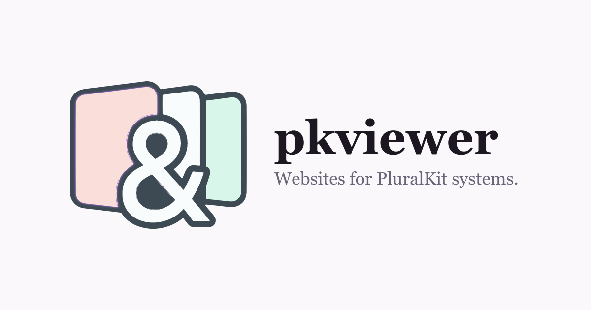

pkviewer turns a [*PluralKit*](https://pluralkit.me) system into a website.

**[pkviewer.xyz](https://pkviewer.xyz)**

PluralKit holds the identity and the data. pkviewer decides how that identity is presented on the web: every system gets a public page, every member can have one, and systems that sign in can choose a readable address and change how their pages look.

!!!warning
pkviewer is a third-party project. It is not PluralKit, and is not affiliated with or endorsed by the PluralKit project. It reads PluralKit's public API and shows only information PluralKit already makes public.
!!!

The feature set is deliberately small, and grows slowly on purpose.

### Addresses

Every system is reachable by its PluralKit ID from the moment it is claimed:

```
https://pkviewer.xyz/s/abcdef
```

Once a system chooses an address, that becomes the friendlier link. Both keep working, and the chosen one is canonical:

```
https://pkviewer.xyz/s/your-system
https://pkviewer.xyz/s/your-system/a-member
```

A chosen address is never required for a page to be public. It only makes the link nicer to share.

### What is public

Only what PluralKit already makes public. A member you keep private in PluralKit does not appear on pkviewer, and pkviewer gives no way to tell that a private member exists at all.

You can hide public information on pkviewer if you would rather not show it — pronouns and birthdays, for example. Hiding removes the value from the page entirely, rather than tucking it out of sight.

### Signing in

Signing in uses Discord, and only to confirm who you are. pkviewer asks Discord for your account ID and username, nothing else: not your servers, not your messages, not your email.

You never have to hand pkviewer a PluralKit token to claim a system. See [*Claiming a system*](/projects/pkviewer/claiming).

### Getting started

1. Sign in at [pkviewer.xyz/login](https://pkviewer.xyz/login) with Discord.
2. Claim your system — usually automatic, see [*Claiming a system*](/projects/pkviewer/claiming).
3. Choose an address and an appearance from [your management page](https://pkviewer.xyz/manage).

### Open source

pkviewer is open source under the [MIT licence](https://github.com/doughmination/pkviewer/blob/main/LICENSE), © 2026 Clove Twilight. You can read the source, run your own copy, or build something else from it.

Two things the licence does not cover:

- **The pkviewer name.** Run your own instance by all means; call it something else if you make it public.
- **The relationship with PluralKit.** pkviewer is an independent third-party project, not affiliated with or endorsed by PluralKit — and anything built from this source is equally independent. If you run your own copy, say so on it too.

The [data on your pages](/projects/pkviewer/privacy) belongs to you and to PluralKit, not to the licence. Nothing about the code being open changes what is public.

### Pages

- [*Claiming a system*](/projects/pkviewer/claiming)
- [*Your public address*](/projects/pkviewer/addresses)
- [*Appearance and layout*](/projects/pkviewer/appearance)
- [*CSS reference*](/projects/pkviewer/css)
- [*Badges*](/projects/pkviewer/badges)
- [*Privacy*](/projects/pkviewer/privacy)
